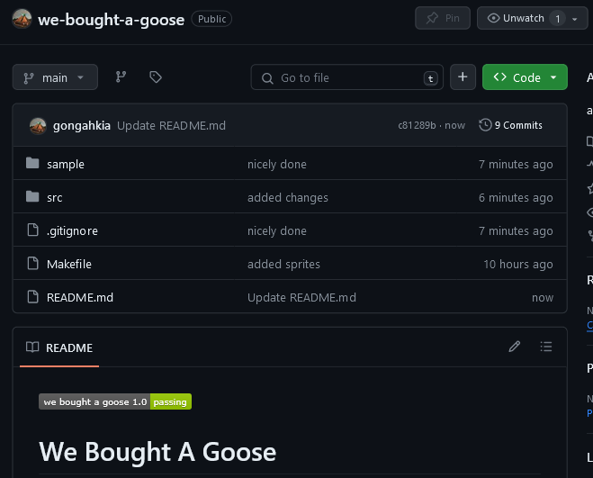
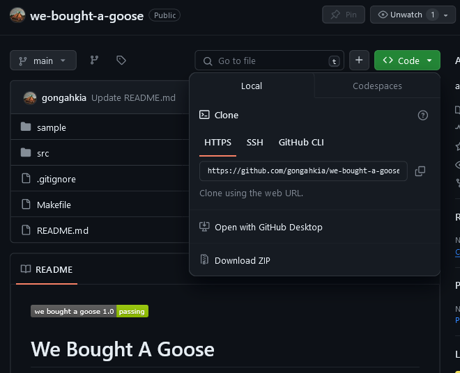

# We Bought A Goose

Adds geese to SMU elearn.


## Installation

### CLI

```console
$ git clone https://github.com/gongahkia/we-bought-a-goose
$ cd we-bought-a-goose
$ make
```

### GUI

1. Click *Code*.



2. Click *Download ZIP*.



3. Unzip the ZIP file.

## Usage

### Firefox

1. Copy and paste this link in the search bar *about:debugging#/runtime/this-firefox*.
2. Click *load temporary add-on*.
3. Open the `we-bought-a-goose` repo, select `manifest.json`.
4. Open **SMU elearn**.
5. Click the goose.

### Chrome

1. Copy and paste this link in the search bar *chrome://extensions/*.
2. Toggle *Developer mode* on.
3. Click *load unpacked*.
4. Open the `we-bought-a-goose` repo, click *select*.
5. Open **SMU elearn**.
6. Click the goose.
